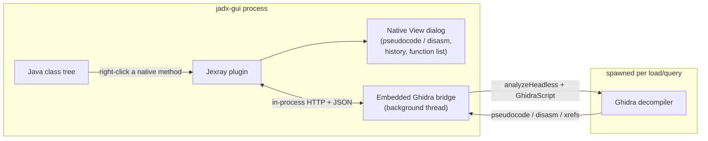

# Jexray

**Native (JNI) code, right inside JADX.**<br>
Not a symbol list — real Ghidra pseudocode, one right-click from the Java method.

Jexray is a [JADX](https://github.com/skylot/jadx) plugin that turns `native` Java methods into a live doorway into the `.so` that implements them. Right-click a native method, and Jexray finds the matching function in the APK's native library, decompiles it with Ghidra, and shows you real pseudocode — with clickable calls, caret-following, and full back/forward history — without ever leaving JADX.

<p align="center">
  
  
  
  
  
  
</p>

---

## Why

Reverse-engineering an Android app that leans on native code today means two disconnected worlds: JADX for the Java/Kotlin side, and IDA/Ghidra for everything behind `System.loadLibrary`. You end up alt-tabbing constantly, manually computing JNI symbol names, and losing your place.

Jexray closes that gap. It ships as one standard plugin jar — no forked build, no patched jadx-gui — loaded through JADX's own `ServiceLoader` mechanism, and drives a real decompiler in the background so what you see is genuine Ghidra output, not a guess. Inspecting bytecode necessarily touches jadx's internal node types, so the tested floor is pinned via `requiredJadxVersion` and JADX refuses to load the plugin below it.

> **Backend:** Jexray currently decompiles with **Ghidra only** — a Ghidra install is required (see [Prerequisites](#prerequisites)). An **IDA Pro** backend is on the [roadmap](#roadmap), designed to slot in behind the very same bridge contract.

## Features

- 🔍 **Automatic JNI mapping** — scans the APK for `native` methods and computes their JNI export symbol automatically.
- 🧠 **Real Ghidra pseudocode & disassembly** — an embedded Ghidra bridge decompiles the actual `.so`, not a static reformat.
- ↔️ **Two-way navigation** — jump Java → native from any native method's context menu, and native → Java from the toolbar however the function was opened (including from the function browser).
- 🧵 **Follow the call graph** — `Ctrl`/`⌘`-click or double-click any function call inside the pseudocode to jump straight into it, as many levels deep as the binary goes.
- 🔎 **Cross-references** — ask who calls a function, from the toolbar **X** button, right-click, or the **X** key over the code; click a caller to jump to it.
- ⏪ **Back / Forward history** — browser-style navigation with a right-click dropdown over your whole trail, deduplicated by address (and library) so revisiting a function never creates a duplicate entry.
- 🎯 **Caret sync** — optionally keep the native view glued to whatever native method your cursor is on in the Java editor.
- 📜 **Function browser** — every function Ghidra found, as a per-library tree split into JNI methods and other functions, with live filtering that counts matches across all libraries and each library's size shown inline.
- 📚 **Loaded Libraries** — the libraries the app loads via `System.loadLibrary`/`System.load`, found by scanning bytecode (not just the classes you have opened), each with its load site (clickable to the Java source) and exported functions. Names held in a single-assignment static field are resolved; obfuscated or computed names are shown as unresolved rather than guessed.
- 🧭 **Multi-library aware** — resolves each native method to whichever `.so` actually defines it (fast local symbol-table scan, no wasted Ghidra analysis on the wrong library) instead of assuming a single native library per app.
- ⚡ **Analyzed once, then instant** — libraries are analyzed concurrently on first load, then cached to disk keyed by each `.so`'s content hash. Reopening an app is instant, and an identical library reuses its cache across different apps; a per-library **Re-analyze** action and a cache size/clear dialog are built in.
- 📦 **One jar, one dependency** — the Ghidra bridge runs embedded inside JADX's own process (no separate server to launch or keep running). The **only** external requirement is a [Ghidra install](#prerequisites) that Jexray drives for you — you point the plugin at it once.
- 🩺 **Version-aware** — JADX itself refuses to load Jexray on an untested JADX build; the Native View toolbar shows the plugin and detected Ghidra version, flagged in red if the Ghidra major version falls outside the supported 11–12 range.

## Architecture



Jexray is a single, standard JADX plugin (`jadx.api.plugins.JadxPlugin`, loaded via `ServiceLoader`, distributed as one jar). It never touches JADX source and works with any JADX build that satisfies the declared minimum version.

On startup, the plugin brings up a small HTTP server *inside JADX's own JVM* — no separate process, no port you have to manage by hand. That embedded server drives Ghidra's `analyzeHeadless` directly: no display, no Ghidra GUI, no Ghidra extension to install, just a background thread that happens to shell out to Ghidra. On first load of a library it decompiles every function once and writes the result to a disk cache keyed by the `.so`'s content hash; every later query — and every later session — is served straight from that cache, and an identical library shared by another app reuses it.

This is intentionally the simplest architecture that gets real decompiler output into JADX. The embedded server talks a plain local JSON contract to the rest of the plugin, so a future backend (see [Roadmap](#roadmap)) can sit behind the exact same interface.

## Prerequisites

| Requirement | Notes |
|---|---|
| **[JADX GUI](https://github.com/skylot/jadx) 1.5.3+** | The host application the plugin installs into. Jexray declares `1.5.3` as its minimum via `requiredJadxVersion` — JADX itself refuses to load the plugin on older builds. Newer releases work too; there is no upper bound. |
| **[Ghidra](https://ghidra-sre.org/) 11.x – 12.x** | Any 11 or 12 release is accepted; 11.3.2 and 12.0 are the versions verified end-to-end with real decompiles. Only the `support/analyzeHeadless` script is used — no GUI session, no Ghidra extension install. |
| **JDK 17+** | Needed to build from source. The embedded bridge never propagates its own host JVM's `JAVA_HOME` into `analyzeHeadless`, so `jadx-gui` itself can run on any modern JDK regardless of which Ghidra version you point it at — Ghidra's own launcher picks a JDK it supports. The only requirement is that **some** JDK Ghidra accepts is installed on the system: Ghidra 11.x needs one ≤21 (its official range) available; Ghidra 12.x accepts a wider range including 25. |

## Installation

### Option A: JADX plugin manager (recommended)

Install straight from JADX by location — no manual download:

```sh
jadx plugins --install "github:cys7885:jexray"
```

…or in jadx-gui: **Preferences → Plugins → Install plugin**, and enter `github:cys7885:jexray`. Once Jexray is listed on the [jadx plugins marketplace](https://github.com/jadx-decompiler/jadx-plugins-list) it will also show up under **Preferences → Plugins → Available**.

### Option B: download the prebuilt jar (no build tools required)

Grab `jexray-<version>.jar` (e.g. `jexray-0.3.1.jar`) from the [latest release](https://github.com/cys7885/jexray/releases/latest). With the [GitHub CLI](https://cli.github.com/) it resolves the version for you:

```sh
gh release download --repo cys7885/jexray --pattern "jexray-*.jar"
```

### Option C: build from source

```sh
git clone https://github.com/cys7885/jexray.git
cd jexray
mvn clean package
# -> target/jexray-<version>.jar
```

### Install it

JADX loads any jar dropped into its **dropins** folder automatically — no need to register it through the Plugins UI:

| OS | Dropins folder |
|---|---|
| macOS | `~/Library/Application Support/io.github.skylot.jadx/plugins/dropins/` |
| Linux | `~/.config/jadx/plugins/dropins/` |
| Windows | `%APPDATA%\jadx\plugins\dropins\` |

> macOS path confirmed by hand; Linux/Windows follow JADX's standard OS config-dir convention but haven't been verified on those platforms yet — please open an issue if yours differs.

```sh
mkdir -p "<dropins folder from the table above>"
cp jexray-<version>.jar "<dropins folder>/"
```

### Point it at Ghidra, and launch

Start (or restart) `jadx-gui`. Jexray resolves the Ghidra install in three steps, stopping at the first that yields a directory containing `support/analyzeHeadless`:

1. **Preferences → Plugins → Jexray Native View → Ghidra install directory**, if set.
2. The `GHIDRA_INSTALL_DIR` environment variable, if exported before launching `jadx-gui`.
3. A best-effort scan of the usual install locations for your OS — Homebrew's Cellar, `/opt`, `/usr/local`, `/usr/share`, `/Applications` and your home directory on macOS/Linux; `C:\`, Program Files and `%LOCALAPPDATA%` on Windows.

So on a typical single-install machine it just works. If you have **several** Ghidra versions installed and did not set step 1 or 2, the scan picks the highest-sorting path — set the option explicitly to control which one is used. The toolbar always shows the version actually detected.

That's it — open an APK and right-click a native method.

## Usage

1. Open an APK in JADX and navigate to any class with a `native` method.
2. Right-click the method → **Show in Native View**.
3. First time only: Jexray extracts the matching `.so` and shows an **"Analyzing… (N/M functions)"** progress indicator while Ghidra decompiles the whole library in the background. Every later lookup against that library is near-instant.
4. In the Native View dialog:
   - `Ctrl`/`⌘`-click, or double-click, any function call in the pseudocode to jump into it.
   - **X** (button, right-click, or the X key over the code) to list the callers of the current function; click one to jump to it.
   - **◀ Back** / **Forward ▶** to retrace your steps; right-click either button for a full history dropdown.
   - **☰ All Functions** to browse every function as a per-library tree; the filter counts matches across all libraries, and each library shows its size. Right-click a library to **Re-analyze** it.
   - **Loaded Libraries** to see what the app loads via `System.loadLibrary`, with load sites and exported functions.
   - Both lists open in a sidebar beside the code, so picking a function and reading it stay one task. Pressing the same button again collapses the sidebar, and its edge drags to resize. Which list was showing, how wide it was, and whether it was open at all come back next time. `Ctrl`/`⌘`+`F` goes to the filter on whichever side you last clicked — the sidebar's or the code's — and `Esc` in a filter clears it.
   - **◀ Go to Java Source** to jump back to the native method's declaration in JADX.
   - **Cache…** to see how much disk the analysis cache uses and clear it.
   - **Sync** toggle to make the dialog follow your caret automatically as you browse native methods in the Java editor.
   - Two quick presses of **Esc** close the dialog.

## Configuration

Open JADX's **Preferences → Plugins → Jexray Native View**:

| Option | Default | Notes |
|---|---|---|
| **Ghidra install directory** | *(empty — falls back to `GHIDRA_INSTALL_DIR`, then auto-detection)* | Set it to pin a specific install; see [Point it at Ghidra](#point-it-at-ghidra-and-launch) for the full resolution order. |
| **Preferred ABIs** | `arm64-v8a,armeabi-v7a,x86_64,x86` | Order used when picking which ABI's copy of each `.so` to consider. |
| **Use embedded bridge** | on | Turn off to point Jexray at an external bridge instead (advanced/development use). |
| **Bridge URL** | `http://localhost:8791` | Only consulted when the embedded bridge is turned off. |

## Building from source

```sh
mvn clean package
```

Produces a single self-contained shaded jar at `target/jexray-<version>.jar`. Test suites are maintained outside this repository and are not part of the published source.

## Security model

Jexray's embedded bridge assumes a **single-user localhost desktop tool**, the same trust model used by comparable local RE-assistant servers (e.g. `ida-pro-mcp`, `GhidraMCP`). Concretely: it binds to `127.0.0.1` only, validates library paths (magic-byte check + canonicalization) and identifiers before shelling out to `analyzeHeadless`, and bounds every subprocess call with a timeout. It does **not** implement authentication or multi-user isolation.

## Roadmap

Deliberately out of scope for the current release, tracked here rather than silently dropped:

- [ ] JNI long-form (signature-encoded) symbol resolution for overloaded native methods
- [ ] IDA Pro backend behind the same bridge contract
- [ ] Optional filter for Ghidra's synthetic `FUN_*` names in the function browser
- [ ] Resolve library names beyond a single-assignment static field (concatenation, computed names)

## Contributing

Issues and PRs welcome. Please prefer JADX's public plugin API (`jadx.api.*`) and never patch jadx-gui source — the plugin must keep installing as a plain dropin jar. Internal `jadx.core.*` types are used where the plugin API hands them to us (a decompile pass receives `ClassNode`/`MethodNode`) or where bytecode-level inspection has no public equivalent; keep new uses of those to the minimum a change actually needs, since they are what a JADX release can break.

Test suites live outside this repository, so a PR is not expected to add tests — describe how you verified the change instead.

## Acknowledgments

- [JADX](https://github.com/skylot/jadx) by skylot — the decompiler this plugin extends, and the whole reason any of this is possible through a stable public plugin API.
- [Ghidra](https://ghidra-sre.org/) by the NSA — the decompiler doing the actual native analysis work here.
- [GhidraMCP](https://github.com/LaurieWired/GhidraMCP) and [ida-pro-mcp](https://github.com/mrexodia/ida-pro-mcp) — studied as architectural precedent while designing the bridge protocol; no code shared.

## License

Apache License 2.0 — see [`LICENSE`](LICENSE).
